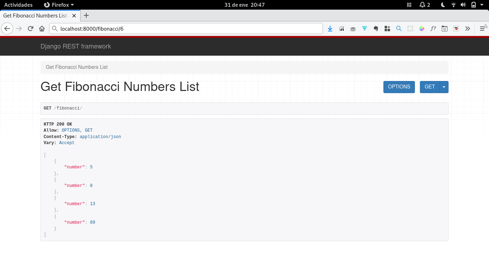

# Calculadora de numeros de la sucesion de Fibonacci

Calculadora de numeros que forman parte de la sucesion de Fibonnaci construida 
con Python, Django, Django Rest Framework y Celery.

Para poder probar en local hay que clonar este repositorio e instalar las dependencias:

```
$ git clone https://github.com/mayela/fibonacci_calc
$ cd fibonacci_calc
$ pipenv install
```

Una vez instaladas las dependencias se necesita tener redis instalado. Esto se puede 
hacer mediante con docker o instalarlo de manera local con el manejador de paquetes
del sistema operativo.

Ya que tengamos redis instalado hay que jecutar el comando ```redis-server``` esto 
iniciara la base que usaremos como broker. También hay que ejecutar el comando 
```python manage.py migrate``` dentro del directorio *fibonacci_calc* y luego 
```python manage.py runserver``` para levantar el servidor de prueba y ```celery -A fibonacci_calc worker --loglevel=info``` que levantará un worker que será el que procesará las 
tareas asíncronas.

Dentro de esta app existen dos endpoint: *fibonacci* y *fibonacci/[number]*. El primero lista los resultados de los procesamientos anteriores y la segunda, al pasarle un numero entero devuelve el número indicado de la sucesión de Fibonacci. Ejemplo:



El número solicitado de la sucesión es el sexto, y este es el 8 dentro de la sucesión.